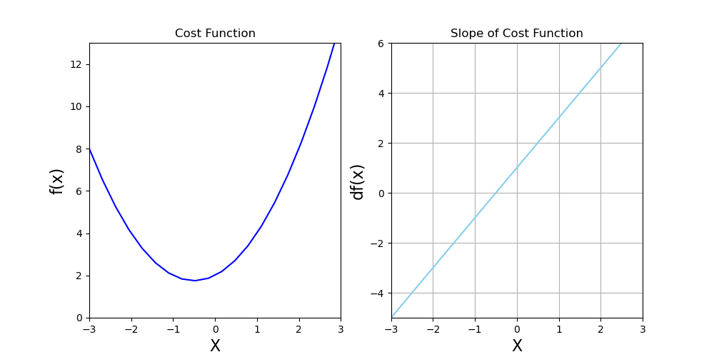
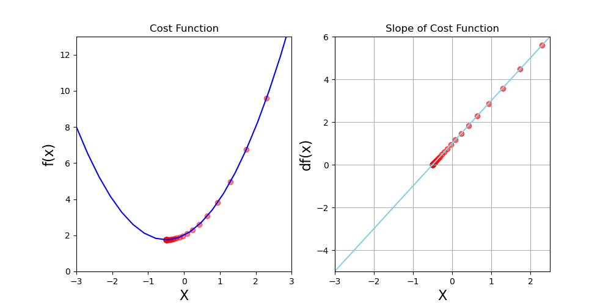
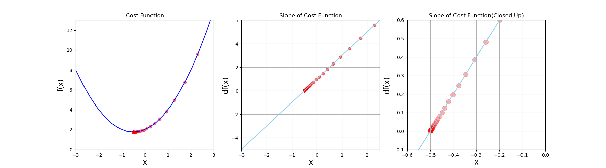

# Some Machine Learning Algorithms
This is a repository that includes some machine learning models and algorithms. The models are built using Python.

## Getting Started
To get started with this project, you will need to clone this repository to your local machine.

## Prerequisites
Make sure you have the following software installed on your local machine:

* Python 3
* NumPy
* Pandas
* Scikit Learn
* TensorFlow
* Matplotlib

## Gradient Descent Algorithm

Here is some simple gradient descent model with learning graph for the function $ f(x) = x^2 + x + 2 $

## Contributing
If you would like to contribute to this project, feel free to submit a pull request.

## License
This project is licensed under the MIT license.
